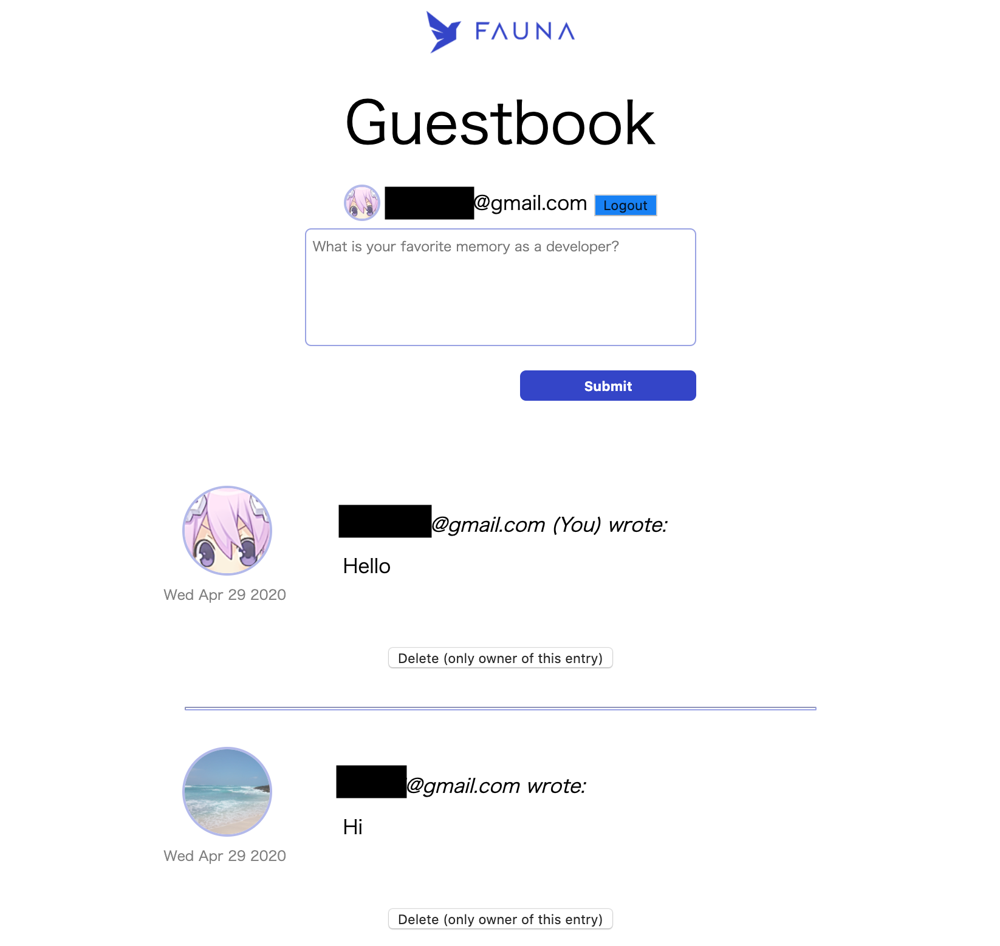
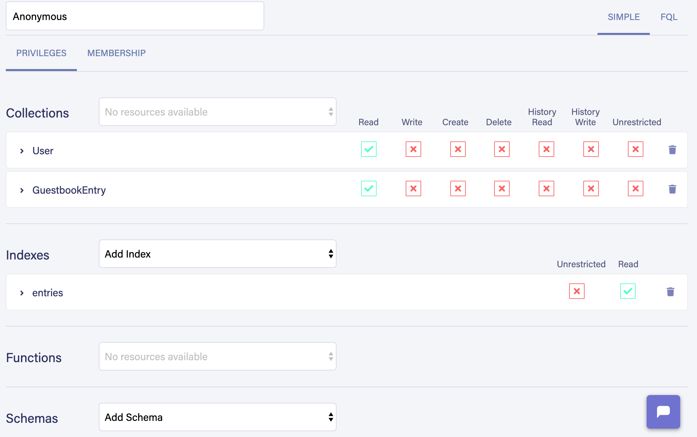
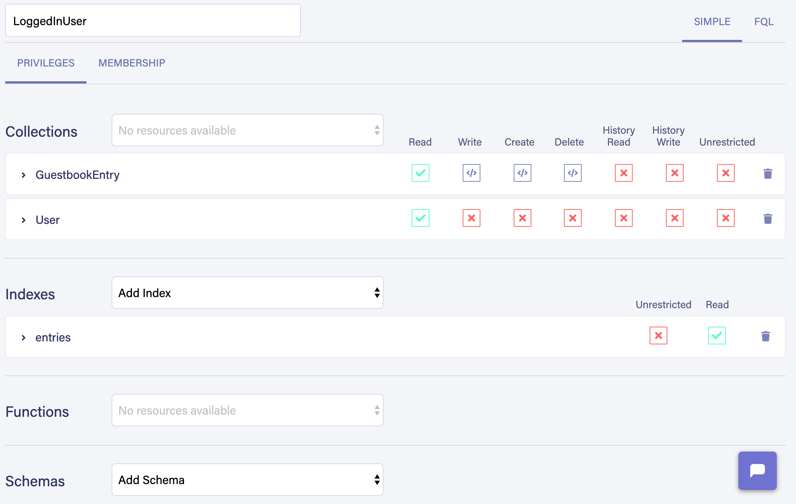
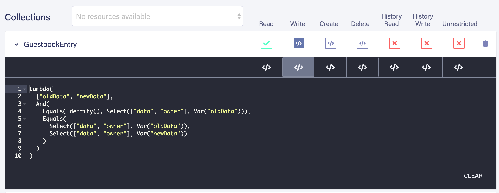
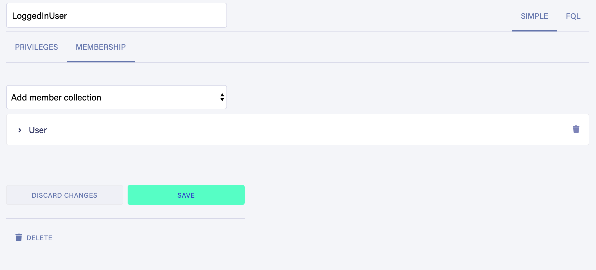
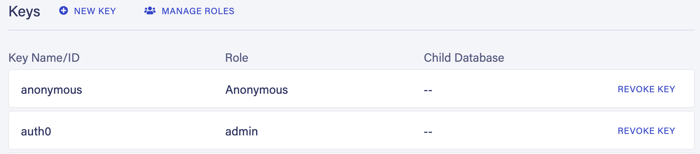
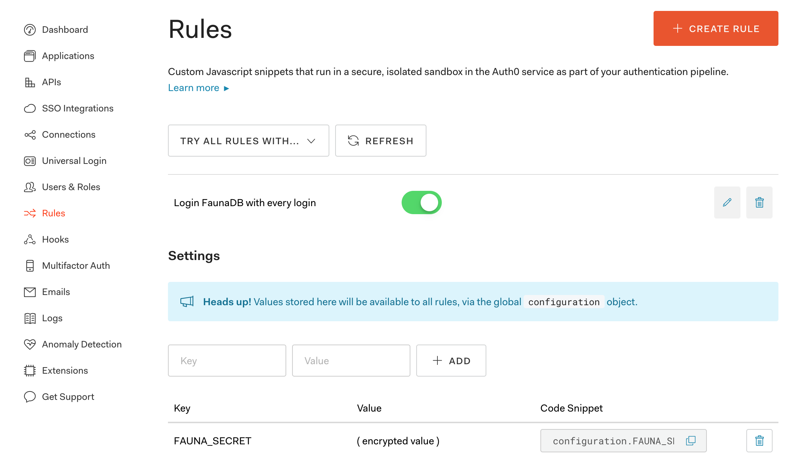
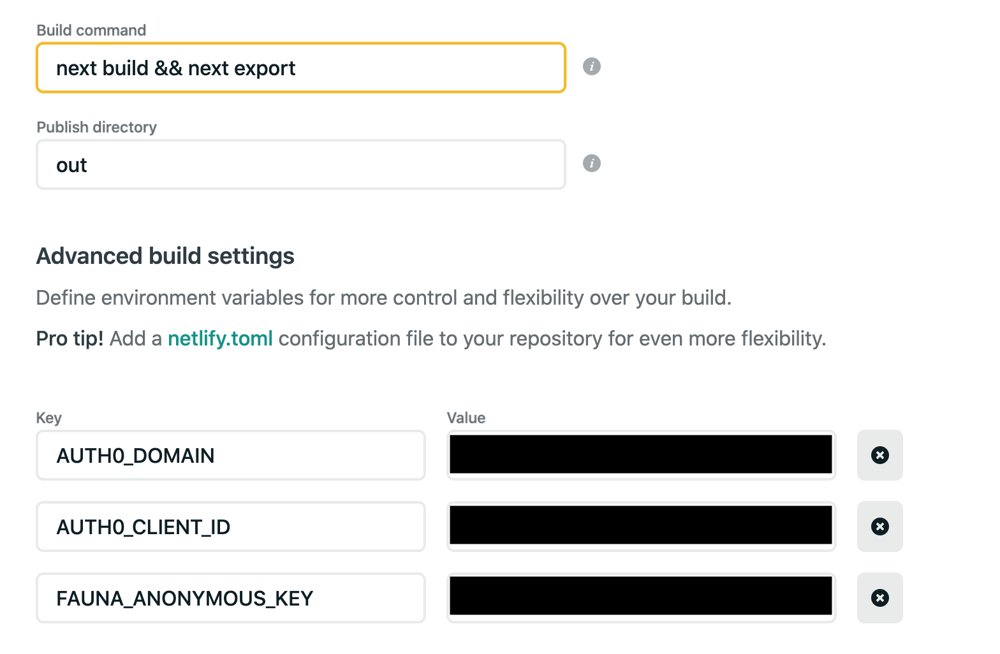

# Next.js example with Auth0 and FaunaDB SPA
Next.js & Auth0 & FaunaDB & GraphQL & SPA


Forked from [Next.js FaunaDB Graphql Starter Example](https://github.com/zeit/next.js/tree/canary/examples/with-graphql-faunadb)



## Getting Started
### Configure FaunaDB
#### Create Collection
Login into [FaunaDB DashBoard](https://dashboard.fauna.com/) and create Database.  
Move to GRAPHQL menu and update schema with [schema.gql](./resources/fauna/schema.gql)

#### Create Roles
Move to SECURITY menu and create roles.

- ``Anonymous`` can read User/GuestbookEntry and get entry list.


- ``LoggedInUser`` can read User/GuestbookEntry and can create/update/delete entry they own and get entry list.

Just remove comment tag in Write/Create/Delete rules :)  

Add membership to User collection.



For details, see my configuration examples [anonymous_role.fql](resources/fauna/anonymous_role.fql), [user_role.fql](resources/fauna/user_role.fql), and [official document](https://docs.fauna.com/fauna/current/tutorials/authentication/abac)

#### Generate server/client keys
In SECURITY menu, create two keys.

- ```Admin``` server key to generate user token on Auth0 login
- ```Anonymous``` client key to get entries for non logged in user 



### Configure Auth0
#### Setup providers
Login [Auth0](https://manage.auth0.com/dashboard/) and setup providers.  
This example assumes that auth providers returns trusted email address. (e.g. Google)  

#### Configure application
See [react-use-auth configuration checklist](https://github.com/Swizec/useAuth#checklist-for-configuring-auth0)

#### Setup rules
Create Rule for generating FaunaDB user token on auth0 login. ([Example](resources/auth0/login-fauna-on-login-auth0.js))  
Set FaunaDB Admin key to FAUNA_SECRET environment variable.



### Setup Environment
```
$ cp .env.example .env
```
Edit .env

```
AUTH0_DOMAIN=<TENANT>.auth0.com
AUTH0_CLIENT_ID=<TOKEN> 
FAUNA_ANONYMOUS_KEY=<KEY> # FaunaDB Anonymous key
```

### Run locally
```
  $ yarn
  $ yarn dev
```

### Deploy
This example is fully SPA, so you can deploy to static file hosting, like Netlify!  
This is example deploy configuration on Netlify



# See also
- [FaunaDB Official Document: Attribute-based access control (ABAC)](https://docs.fauna.com/fauna/current/tutorials/authentication/abac)
- [Blog: Using FaunaDB with an Identity Provider](https://www.felix-gehring.de/articles/2020/01/28/using-faunadb-with-an-identity-provider/)